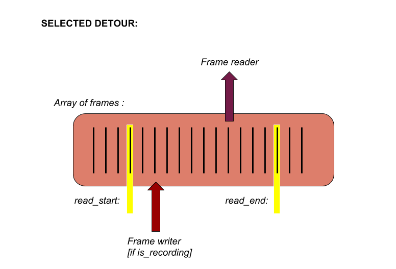

# __DETOUR__ 
## _an in-memory frame-based video processor_

### preface

this is an experiemnt in documentation driven development. the idea is to define first the operation of a rpi-frame-sampler instrument based on the proof-of-concept @Autr and i created and inspired by the JonesFrameBuffer i saw at signal culture. Once the function is described it should be easier for me to develop it without being so distracted by new ideas.

with this new project i want to focus on creating something that does a few things really well rather than trying to do everything a bit hacky. i will try to learn how to unit test in OpenFrameworks and hopefully practice test-driven-development

## DETOUR : documentation

### overview

DETOUR is a video performance tool that receives video-input and allows dynamic short-term access to it by recording frames into RAM. unlike RECUR (/ other video samplers) these frames are only held 'in-memory' (RAM) and never 'stored' (to disk). although limited to only a few minutes of sd recording, any frame can be accessed instantly allowing much more control over the playback. the output (and recording) is a mix of the video-input and the _detours_ (in-memory frame arrays)

### hardware

v1 will use the following:

- raspberry pi 3b
- piCaptureSd1 (or piCamera)
- akai lpd8 midi controller (or otherwise)

### flow diagrams

### states and displays

I want to keep UI to a minimum. however the device needs to keep track of a few different states and optional visual feedback of these is useful for learning:

- `current_detour` : __d0__ , __d1__, __d2__, __d3__
- `is_playing` : bool for if the current_detour playing.
- `is_recording` : bool for if recording into current_detour.
- `record_loop`: bool for if recording is in _loop_mode_ : when reaching `read_end` of `current_detour` starts recording from `read_start` or _expand_mode_ : when reaching `read_end` create a new frame on the end
- `detour_position` : where the `current_detour` frame reader is set
- `detour_speed` : how frequently the `current_detour` frame reader is incremented
- `memory_full` : a switch for when the RAM is full ; when __true__ _expand_mode_ is not possible.
- `sample_resolution` : the size that the incoming-video frames are sampled at
- `sample_speed` : how frequently the incoming-video is sampled

### user inputs

the instrument is controlled by a combination of _knobs_ (midi-cc) and _pads_ (midi-notes)

- _pads_ for selecting `current_detour` , and (once selected) for toggling `is_playing` 
- _pads_ for toggling `is_recording` and `record_loop`
- a _pad_ for __deleting__ frames from `current_detour` (default is only frames outside of `read_start` and `read_end`)
- a _pad_ for toggling the onscreen display/printout ...

- a _knob_ for setting the _position_ of `current_detour`'s `frame_reader` (when `play` is off) or setting the _speed_ the reader moves at (when `play` is on) 
- a _knob_ for setting the `mix` between _input_ and _detours_
- two _knobs_ for setting the `read_start` and `read_end` of the `current_detour`
- a _knob_ for setting the _sample_resolution_ of incoming video

### a technical note on _detour_ position and sizes:

the `detour_position` will always be set as a percentage between the `read_start` and `read_end` values. if these values change, the next `detour_position` update will reflect this. 

for example, say the `current_detour` is __20__ frames. `start` is __5__ and `end` is __15__. midi-cc values are between 0 and 127. the `position` cc is set to __50__, which is 50 / 127 = 0.394; the posible range is __10__ frames (end: 15 minus start: 5) so the position frame is set to 10 * 0.394 +start = 3.94 + 5 = 3 + 5 (we will always round down) = __8__ .

now `end` is updated to frame __20__ , so if `position` cc is set to __50__ again,  ( floor(0.394 * 15) + 5 = _10_ ) the position is now set to __10__

however. the total number of frames in _currnet_detour_ can also change (by recording in expand_mode) so in the same way the `start` and `end` frames could change depending of the total size. it might be better to change this but will keep this logic for now...

## messy list of possible future ideas and direction

- dedicated hardware ...
- more control over frame-sampler settings (colour depth ? )
- toggling different blend-modes : average-mix, additive-mix, luma-key, wipe etc
- other interesting param effects : chroma balance, left/right movement
- another mix-mode between video-input and feedback-input
- double-press delete or something to delete whole detour without moving start/end
- detour only plays on pad-press (option to toggle show/+play on press) for finger-drumming
- logic for forward-back switch, ping-pong mode, maybe random access ?
- maybe try controling the detour-write position/speed too ?

