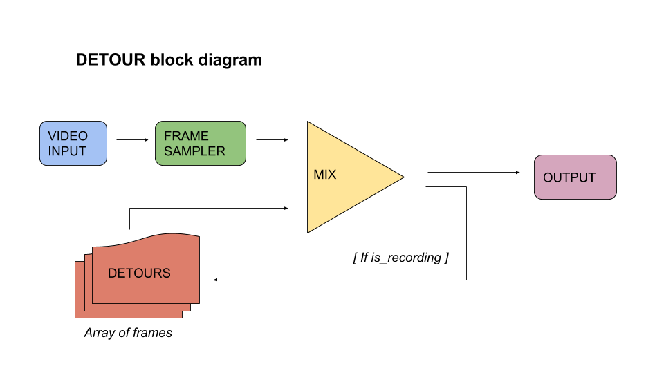

# __d_e_t_o_u_r__

## _an in-memory frame sampler/processor for rpi_

<vector image coming soon>

__d_e_t_o_u_r__ is  _raspberry pi_ video performance tool that samples `input` video frames ( from _piCaptureSd1_ ) into RAM and allows dynamic short-term access to them via _midi control_ 

<demo video coming sometime>

this is an open community project based on the [proof-of-concept] @[Autr] and i created and inspired by the [JonesFrameBuffer]

### overview / features

blahblahblah

### hardware

v1 will use the following:

- raspberry pi 3b
- piCaptureSd1 (or piCamera)
- akai lpd8 midi controller (or otherwise)

###

<part of a ? open-diy-video-hardware ? project ..>

### 

[proof-of-concept]: https://github.com/autr/rpi-frame-sampler
[autr]: https://github.com/autr
[JonesFrameBuffer]: http://www.experimentaltvcenter.org/jones-frame-buffer-prototype